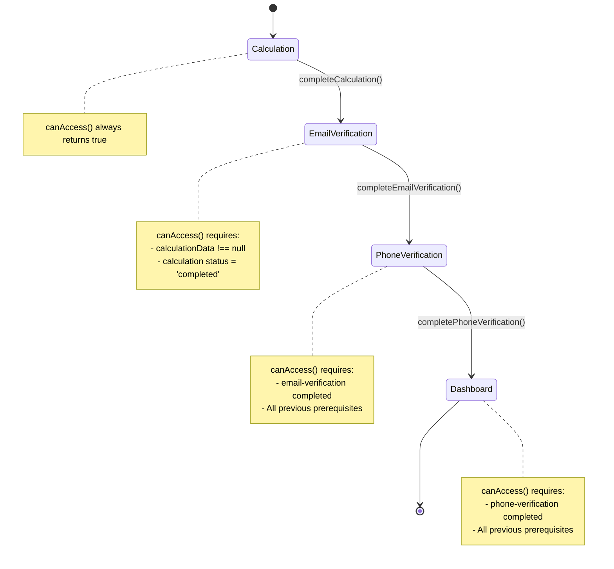
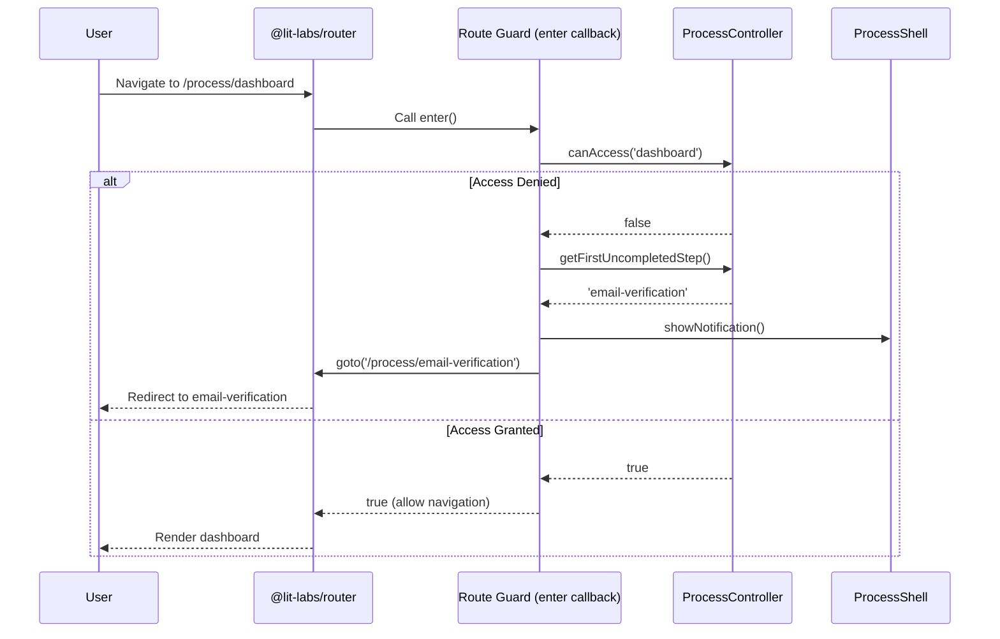

# Technical Design: Process State Management

## Overview

This design implements ADR 0003 (Process State Management via ReactiveController and @lit/context) by adding route guards, step progression validation, and user notifications to the Application Process flow. The implementation ensures users follow the correct sequence through calculation, email verification, phone verification, and dashboard steps while maintaining architectural consistency with Lit's component model and @lit-labs/router.

The core enhancement is the addition of **route guards** that validate step accessibility before rendering, preventing users from skipping required prerequisites. When access is denied, users are redirected to the first uncompleted step with a clear notification explaining why.

### Key Design Principles

1. **Declarative Route Guards**: Each route's `enter` callback validates access using `ProcessController.canAccess(step)`
2. **Graceful Degradation**: On page refresh with in-memory state loss, users are redirected to the appropriate starting point
3. **Progressive Enhancement**: The stepper UI reflects step availability in real-time based on ProcessController state
4. **User-Centric Notifications**: Clear messaging when redirects occur, respecting user experience
5. **VSA Alignment**: New step pages follow existing patterns with co-located components

## Architecture

### Component Hierarchy

```
process-shell (provides ProcessController via context)
  ├─ Routes + Route Guards (enter callbacks)
  ├─ Stepper UI (visual step availability)
  ├─ Notification System (user feedback)
  └─ Step Pages (consume ProcessController)
       ├─ calculation-step-page
       ├─ email-verification-step-page
       ├─ phone-verification-step-page
       └─ dashboard-step-page
```

### State Flow



### Route Guard Flow



## Components and Interfaces

### 1. ProcessController Enhancement

**New Method: `getFirstUncompletedStep()`**

```typescript
/**
 * Returns the first step that is not yet completed.
 * Used for redirect logic when route guards block access.
 */
getFirstUncompletedStep(): ProcessStep {
  const stepOrder: ProcessStep[] = [
    'calculation',
    'email-verification',
    'phone-verification',
    'dashboard'
  ];
  
  return stepOrder.find(step => this.stepStatuses[step] === 'pending') || 'calculation';
}
```

**Purpose**: Provides deterministic redirect target when `canAccess()` returns false.

### 2. ProcessShell Enhancement

**Route Guard Implementation**

Each route definition will include an `enter` callback that:

1. Checks `this.processCtrl.canAccess(step)`
2. If false, calls `this.processCtrl.getFirstUncompletedStep()`
3. Triggers notification via `this._showRedirectNotification()`
4. Redirects using `this.routes.goto()`
5. Returns false to block original navigation

**Example Route with Guard**:

```typescript
{
  path: "/email-verification",
  enter: async () => {
    await import("./pages/email-verification-step-page.js");
    
    if (!this.processCtrl.canAccess('email-verification')) {
      const redirectTo = this.processCtrl.getFirstUncompletedStep();
      this._showRedirectNotification(redirectTo);
      this.routes.goto(`/process/${redirectTo}`);
      return false;
    }
    
    return true;
  },
  render: () => html`<email-verification-step-page></email-verification-step-page>`
}
```

**Notification System**

```typescript
private notificationVisible = false;
private notificationMessage = '';
private notificationTimeout?: number;

private _showRedirectNotification(targetStep: ProcessStep) {
  const stepLabels: Record<ProcessStep, string> = {
    'calculation': 'Kalkulacja',
    'email-verification': 'Weryfikacja Email',
    'phone-verification': 'Weryfikacja Telefonu',
    'dashboard': 'Panel'
  };
  
  this.notificationMessage = `Aby kontynuować, najpierw ukończ krok: ${stepLabels[targetStep]}`;
  this.notificationVisible = true;
  
  if (this.notificationTimeout) {
    clearTimeout(this.notificationTimeout);
  }
  
  this.notificationTimeout = window.setTimeout(() => {
    this.notificationVisible = false;
    this.requestUpdate();
  }, 3000);
}

private _dismissNotification() {
  if (this.notificationTimeout) {
    clearTimeout(this.notificationTimeout);
  }
  this.notificationVisible = false;
}
```

**Stepper UI Enhancement**

The stepper will now reflect step availability:

```typescript
private _renderStepItem(step: ProcessStep, index: number, label: string) {
  const isActive = this.getActiveStep() === step;
  const isAccessible = this.processCtrl.canAccess(step);
  const isCompleted = this.processCtrl.stepStatuses[step] === 'completed';
  
  if (!isAccessible) {
    return html`
      <div 
        class="step-item disabled"
        title="Ukończ poprzednie kroki aby odblokować"
      >
        <span class="step-badge">${index + 1}</span>
        <span>${label}</span>
      </div>
    `;
  }
  
  return html`
    <a
      href="/process/${step}"
      class="step-item ${isActive ? 'active' : ''} ${isCompleted ? 'completed' : ''}"
    >
      <span class="step-badge">${index + 1}</span>
      <span>${label}</span>
    </a>
  `;
}
```

### 3. New Step Pages

All new pages follow the existing pattern established by `income-step-page.ts`:

#### calculation-step-page.ts

```typescript
@customElement('calculation-step-page')
export class CalculationStepPage extends LitElement {
  @consume({ context: processContext, subscribe: true })
  @state()
  private processCtrl?: ProcessController;
  
  private _handleComplete(data: CalculationData) {
    this.processCtrl?.completeCalculation(data);
    this.dispatchEvent(
      new CustomEvent("request-navigate", {
        detail: "/process/email-verification",
        bubbles: true,
        composed: true,
      })
    );
  }
  
  // Form UI for calculation parameters
}
```

#### email-verification-step-page.ts

```typescript
@customElement('email-verification-step-page')
export class EmailVerificationStepPage extends LitElement {
  @consume({ context: processContext, subscribe: true })
  @state()
  private processCtrl?: ProcessController;
  
  connectedCallback() {
    super.connectedCallback();
    
    // Guard: redirect if calculation not completed
    if (!this.processCtrl?.canAccess('email-verification')) {
      const redirectTo = this.processCtrl?.getFirstUncompletedStep() || 'calculation';
      // ProcessShell handles the redirect via route guard
    }
  }
  
  private _handleVerify(email: string) {
    this.processCtrl?.completeEmailVerification(email);
    this.dispatchEvent(
      new CustomEvent("request-navigate", {
        detail: "/process/phone-verification",
        bubbles: true,
        composed: true,
      })
    );
  }
  
  // Email input + verification button UI
}
```

#### phone-verification-step-page.ts

```typescript
@customElement('phone-verification-step-page')
export class PhoneVerificationStepPage extends LitElement {
  @consume({ context: processContext, subscribe: true })
  @state()
  private processCtrl?: ProcessController;
  
  private _handleVerify(phone: string) {
    this.processCtrl?.completePhoneVerification(phone);
    this.dispatchEvent(
      new CustomEvent("request-navigate", {
        detail: "/process/dashboard",
        bubbles: true,
        composed: true,
      })
    );
  }
  
  // Phone input + verification button UI
}
```

#### dashboard-step-page.ts

```typescript
@customElement('dashboard-step-page')
export class DashboardStepPage extends LitElement {
  @consume({ context: processContext, subscribe: true })
  @state()
  private processCtrl?: ProcessController;
  
  render() {
    return html`
      <div class="dashboard">
        <h2>Panel podsumowania</h2>
        <dl>
          <dt>Kwota kredytu:</dt>
          <dd>${this.processCtrl?.calculationData?.loanAmount} zł</dd>
          
          <dt>Okres:</dt>
          <dd>${this.processCtrl?.calculationData?.periodMonths} miesięcy</dd>
          
          <dt>Rata miesięczna:</dt>
          <dd>${this.processCtrl?.calculationData?.monthlyInstallment} zł</dd>
          
          <dt>Email:</dt>
          <dd>${this.processCtrl?.email}</dd>
          
          <dt>Telefon:</dt>
          <dd>${this.processCtrl?.phone}</dd>
        </dl>
        
        <button @click=${this._handleReset}>Rozpocznij nowy proces</button>
      </div>
    `;
  }
  
  private _handleReset() {
    this.processCtrl?.reset();
    this.dispatchEvent(
      new CustomEvent("request-navigate", {
        detail: "/process/calculation",
        bubbles: true,
        composed: true,
      })
    );
  }
}
```

### 4. Route Migration Strategy

**Backward Compatibility Redirects**

To maintain compatibility with old bookmarks/links:

```typescript
{
  path: "/income",
  enter: async () => {
    // Redirect old route to new route
    this.routes.goto("/process/calculation");
    return false;
  },
  render: () => html``
},
{
  path: "/summary",
  enter: async () => {
    // Redirect old route to dashboard
    this.routes.goto("/process/dashboard");
    return false;
  },
  render: () => html``
}
```

## Data Models

### Notification State

```typescript
interface NotificationState {
  visible: boolean;
  message: string;
  type: 'info' | 'warning' | 'error';
  timeout?: number;
}
```

### Step Labels Map

```typescript
const STEP_LABELS: Record<ProcessStep, string> = {
  'calculation': 'Kalkulacja',
  'email-verification': 'Weryfikacja Email',
  'phone-verification': 'Weryfikacja Telefonu',
  'dashboard': 'Panel'
};
```

### Route Path Map

```typescript
const STEP_ROUTES: Record<ProcessStep, string> = {
  'calculation': '/process/calculation',
  'email-verification': '/process/email-verification',
  'phone-verification': '/process/phone-verification',
  'dashboard': '/process/dashboard'
};
```

## Correctness Properties

*A property is a characteristic or behavior that should hold true across all valid executions of a system—essentially, a formal statement about what the system should do. Properties serve as the bridge between human-readable specifications and machine-verifiable correctness guarantees.*

### Property 1: Route Guard Blocks Inaccessible Steps

*For any* process step and current ProcessController state, when `canAccess(step)` returns `false`, the route guard SHALL block navigation and redirect to `getFirstUncompletedStep()`.

**Validates: Requirements 2.1, 2.2, 2.3, 2.4**

### Property 2: Calculation Step Always Accessible

*For any* ProcessController state, the route guard for the 'calculation' step SHALL always allow access without prerequisites.

**Validates: Requirements 2.5**

### Property 3: Redirect Target Matches First Uncompleted Step

*For any* ProcessController state where a step is inaccessible, the redirect target SHALL match the result of `getFirstUncompletedStep()`.

**Validates: Requirements 3.1, 3.2, 3.3, 3.4**

### Property 4: Step Accessibility Follows Prerequisites Chain

*For any* step in the sequence, `canAccess(step)` SHALL return `true` if and only if all preceding steps have status 'completed' and their required data is populated.

**Validates: Requirements 2.1, 2.2, 2.3**

### Property 5: Stepper Visual State Reflects Controller State

*For any* ProcessController state change, the stepper UI SHALL update to reflect the current accessibility of each step (disabled for inaccessible, clickable for accessible).

**Validates: Requirements 6.1, 6.2, 6.3**

### Property 6: Notification Displays on Guard Redirect

*For any* route guard that blocks access and redirects, a notification SHALL be displayed with the target step name for 3 seconds or until dismissed.

**Validates: Requirements 5.1, 5.2, 5.3**

### Property 7: Page Refresh Maintains Guard Enforcement

*For any* browser page refresh on a step page, if the in-memory state does not satisfy `canAccess(step)`, the route guard SHALL redirect to the appropriate step.

**Validates: Requirements 7.1, 7.2**

### Property 8: Backward Compatible Route Redirects Work

*For any* navigation to legacy routes '/process/income' or '/process/summary', the system SHALL redirect to the appropriate modern route based on the current mapping.

**Validates: Requirements 8.1, 8.2**

## Error Handling

### Route Guard Failures

**Scenario**: `ProcessController.canAccess()` throws an error

**Handling**:
- Catch error in `enter` callback
- Log error to console with context
- Default to allowing navigation to 'calculation' step
- Show error notification to user

```typescript
enter: async () => {
  try {
    if (!this.processCtrl.canAccess(step)) {
      // redirect logic
    }
  } catch (error) {
    console.error('[RouteGuard] Error checking access:', error);
    this._showErrorNotification('Wystąpił błąd. Przekierowanie do początku.');
    this.routes.goto('/process/calculation');
    return false;
  }
  return true;
}
```

### Missing ProcessController

**Scenario**: Step page cannot access ProcessController via context

**Handling**:
- Check `if (!this.processCtrl)` in component lifecycle
- Render error state UI with link back to process start
- Log warning to console

```typescript
render() {
  if (!this.processCtrl) {
    return html`
      <div class="error-state">
        <p>Nie można załadować stanu procesu.</p>
        <a href="/process">Powrót do początku</a>
      </div>
    `;
  }
  
  // normal render
}
```

### Navigation Loop Detection

**Scenario**: Redirect logic creates infinite loop

**Prevention**:
- Guard redirects only occur when `canAccess()` returns false
- `getFirstUncompletedStep()` always returns a valid step
- 'calculation' step has no prerequisites, ensuring escape hatch

### Timeout Cleanup

**Scenario**: Component unmounts before notification timeout expires

**Handling**:
```typescript
disconnectedCallback() {
  super.disconnectedCallback();
  if (this.notificationTimeout) {
    clearTimeout(this.notificationTimeout);
  }
}
```

## Testing Strategy

### Unit Testing

**ProcessController Tests**:
- `canAccess()` returns correct boolean for each step given various state combinations
- `getFirstUncompletedStep()` returns correct step for all state permutations
- State mutations (`completeCalculation`, `completeEmailVerification`, etc.) update status correctly
- `reset()` returns state to initial values

**Step Page Tests**:
- Pages consume ProcessController context correctly
- Navigation events dispatch with correct detail payload
- Error states render when context unavailable

### Integration Testing

**Route Guard Tests**:
- Navigating to protected route without prerequisites triggers redirect
- Navigating to protected route with prerequisites allows access
- Notification appears when redirect occurs
- Backward compatibility redirects work for legacy routes

**Stepper UI Tests**:
- Stepper reflects step accessibility correctly
- Clicking disabled step shows tooltip
- Active step is visually highlighted
- Completed steps show completion indicator

**End-to-End Flow Tests**:
- User can complete entire process from calculation to dashboard
- Attempting to skip steps redirects appropriately
- Page refresh on any step maintains guard enforcement
- Browser back/forward buttons respect guard logic

### Property-Based Testing

This feature involves primarily **UI interactions, routing logic, and side-effect operations** (navigation, notifications, DOM updates). Property-based testing is **not appropriate** here because:

1. **No pure functions with universal properties**: The route guards produce side effects (redirects, notifications) rather than returning values that can be universally tested
2. **State-dependent UI rendering**: The stepper and pages render based on specific state combinations, not universal input spaces
3. **Integration-focused**: The behavior depends on `@lit-labs/router` behavior, DOM events, and lifecycle timing

**Alternative Testing Approaches**:
- **Example-based unit tests** for `canAccess()` and `getFirstUncompletedStep()` with specific state scenarios
- **Integration tests** with @web/test-runner to verify guard behavior in realistic navigation flows
- **Manual QA** for visual validation of stepper states and notification timing

### Test Configuration

- **Framework**: @web/test-runner with @esm-bundle/chai
- **Coverage Target**: 85% for ProcessController, 70% for UI components
- **Mock Strategy**: Mock ProcessController for page tests, use real controller for integration tests

## Implementation Notes

### File Structure

```
src/features/process/
├── pages/
│   ├── calculation-step-page.ts          [NEW]
│   ├── email-verification-step-page.ts   [NEW]
│   ├── phone-verification-step-page.ts   [NEW]
│   ├── dashboard-step-page.ts            [NEW]
│   ├── process-start-page.ts             [MODIFY - redirect to calculation]
│   ├── income-step-page.ts               [KEEP for backward compat]
│   └── summary-step-page.ts              [KEEP for backward compat]
├── controllers/
│   └── process-controller.ts             [MODIFY - add getFirstUncompletedStep()]
├── process-shell.ts                       [MODIFY - add guards, notification, stepper logic]
├── context.ts                             [NO CHANGE]
└── types.ts                               [NO CHANGE]
```

### Implementation Order

1. **Phase 1**: Enhance ProcessController with `getFirstUncompletedStep()`
2. **Phase 2**: Add notification system to ProcessShell
3. **Phase 3**: Implement route guards in ProcessShell routes
4. **Phase 4**: Enhance stepper UI to reflect step accessibility
5. **Phase 5**: Create new step pages (calculation, email-verification, phone-verification, dashboard)
6. **Phase 6**: Add backward compatibility redirects
7. **Phase 7**: Write tests for all new functionality

### CSS Design Tokens

```css
/* Notification Banner */
--notification-bg: #fffbeb;
--notification-border: #fbbf24;
--notification-text: #92400e;

/* Disabled Step */
--step-disabled-bg: #f8fafc;
--step-disabled-text: #cbd5e1;
--step-disabled-border: #e2e8f0;

/* Completed Step */
--step-completed-bg: #dcfce7;
--step-completed-text: #166534;
--step-completed-border: #86efac;
```

### Performance Considerations

- **Route guard execution time**: < 5ms (single `canAccess()` call + conditional logic)
- **Stepper re-render**: Only when ProcessController state changes (reactive)
- **Notification timeout**: Auto-dismiss after 3 seconds to avoid memory leaks
- **Lazy loading**: All step pages dynamically imported in `enter` callbacks

### Accessibility

- **Stepper**: Semantic `<nav>` with `aria-label="Kroki procesu"`
- **Disabled steps**: `aria-disabled="true"` and `title` attribute with explanation
- **Notifications**: `role="alert"` for screen reader announcement
- **Focus management**: Maintain focus on main content after redirect (no focus trap)

### Localization

All user-facing strings are currently in Polish. For future i18n support:
- Extract `STEP_LABELS` to localization file
- Extract notification messages to translation keys
- Consider using `@lit/localize` for reactive translations

## Dependencies

- **@lit-labs/router**: v0.1.4 (route management)
- **@lit/context**: v1.1.6 (state distribution)
- **lit**: v3.3.3 (component framework)

No additional dependencies required.

## Migration Impact

### Breaking Changes

**Route URLs**: The following routes are being renamed to match ADR 0003:
- `/process/income` → `/process/calculation` (backward compat redirect maintained)
- `/process/summary` → `/process/dashboard` (backward compat redirect maintained)

### Developer Impact

- Developers adding new process steps must implement `canAccess()` logic in ProcessController
- New step pages must follow the established pattern (consume context, dispatch navigation events)
- Route definitions must include `enter` guards for protected steps

### User Impact

- Users will see clearer step indicators showing which steps are accessible
- Attempting to skip steps will show helpful notification explaining what to complete first
- Page refreshes will maintain process integrity by enforcing guards

## Future Enhancements

1. **Persistent State**: Add localStorage/sessionStorage hydration to ProcessController
2. **Progress Persistence**: Store partial form data for each step
3. **Step Validation**: Add validation summary showing why each step is blocked
4. **Analytics Integration**: Track redirect events and guard blocks
5. **Animation**: Add transition animations between step pages
6. **Accessibility Audit**: Full WCAG 2.1 AA compliance review
7. **Mobile Optimization**: Responsive stepper design for small screens
